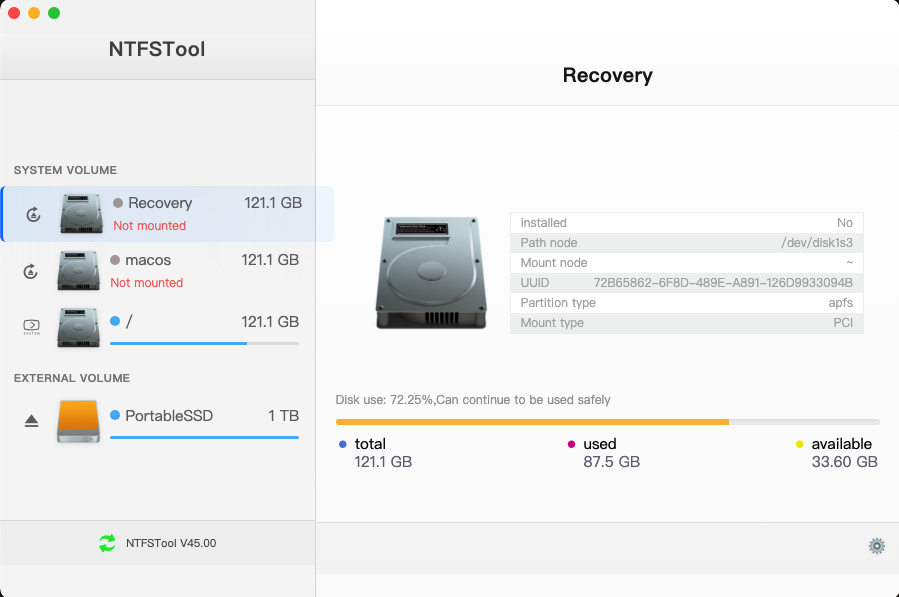
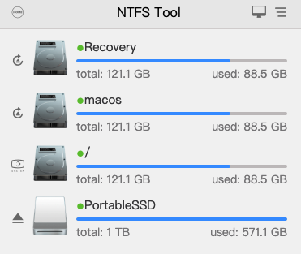
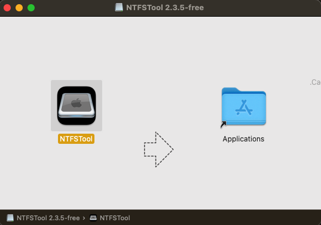
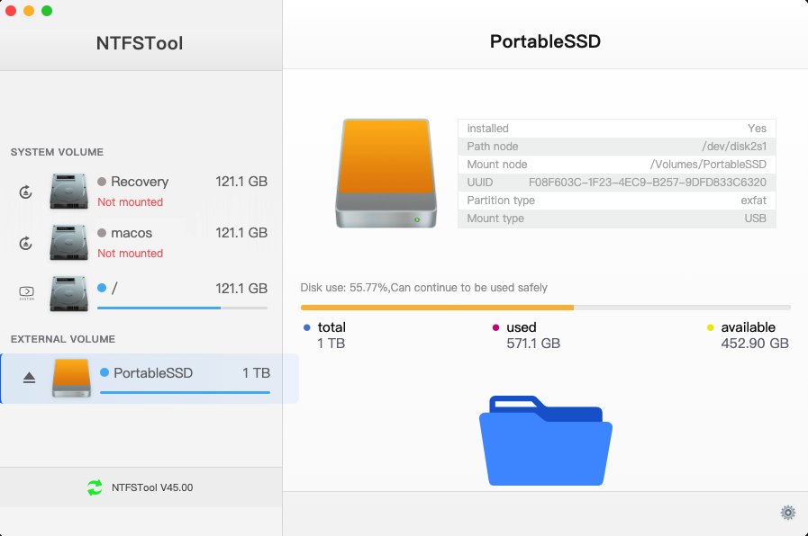

# NTFS Tool - Free & Open Source Fork
# Support Apple Silicon M1/M2/M3/M4 & Intel Macs


[](https://opensource.org/licenses/MIT)
[](http://makeapullrequest.com)

English | [简体中文](./README-CN.md)

## 🎉 Free and Open Source NTFS Tool for macOS

**This is a community-maintained free fork** of NTFS Tool, created with the **explicit permission** of the original author **Dr_rOot**. We are grateful for their contribution to making this powerful NTFS management tool available to the community.

### Major Enhancements by Sabih Haider (2025)

This fork has been significantly modernized and enhanced with:

- **🎨 Complete UI Modernization**: Upgraded from legacy Electron UI to modern macOS Monterey design
- **📁 ExFAT Support**: Added full ExFAT file system support alongside NTFS
- **⚙️ Electron Migration**: Upgraded to Vue 3, Element Plus, and modern Electron architecture
- **🌍 Enhanced Internationalization**: Improved language support with 20+ languages
- **🐛 Critical Bug Fixes**: Fixed disk usage calculations, Settings page, and sudo password issues
- **✨ UX Improvements**: Modern frosted glass effects, color-coded indicators, smooth animations

### Credits & Attribution

- **Original Author**: Dr_rOot - Creator of NTFS Tool and original codebase
- **Modernization & Enhancement**: Sabih Haider - Vue 3 migration, ExFAT support, UI redesign, bug fixes
- **Community Contributors**: All contributors who have helped improve this fork

> 📢 **Important Notice**: This fork removes all paid restrictions and license checks. All features are freely available to everyone. See [FREE_USE_NOTICE.md](./FREE_USE_NOTICE.md) for complete details.

### What is NTFS Tool?

NTFS Tool provides seamless NTFS read and write support for macOS. It enables full read/write access to Windows NTFS-formatted drives on your Mac without any limitations.

✈️ [GitHub Repository](https://github.com/sabih-haider1/ntfstool) | 📖 [Documentation](./FREE_USE_NOTICE.md) | 🐛 [Report Issues](https://github.com/sabih-haider1/ntfstool/issues) | 👨‍💻 [Developer Portfolio](https://sabih-ssy.vercel.app/)

## 💽 Installation

### Download

📥 **[Download NTFS Tool (v2.3.5-free)](https://drive.google.com/drive/folders/1QzzAVNK1rsjbkXhdQsqF7XX23-Nu7x0V?usp=sharing)** - macOS .dmg installer

**No license key or activation required** - just download, install, and use!

### Platform Support

Currently supports macOS only (Intel and Apple Silicon).

### macOS Requirements

- macOS 10.14 (Mojave) or later
- Works on both Intel and Apple Silicon (M1/M2/M3/M4) Macs

## ✨ Features

- 🆓 **Completely Free** - No license keys, no subscriptions, no restrictions
- 🕹 Simple and clear user interface with modern macOS Monterey design
- 🦄 Full NTFS **and ExFAT** disk read and write operations
- ☑️ Real-time disk capacity monitoring with accurate percentage calculations
- 💾 Manual refresh of disk information
- 🎛 Disk space usage visualization with color-coded indicators
- 🚀 Safe disk unmounting for both NTFS and ExFAT
- 🔔 Operation completion notifications
- 💻 Touch Bar support
- 🤖 System tray integration with modern dropdown menu
- 🌍 Multi-language support (20+ languages - [View supported languages](#-internationalization))
- 🍎 Native Apple Silicon support (M1/M2/M3/M4)
- ⚙️ Fully functional Settings page with all preferences
- 🎏 Regular updates from community contributors

### File System Support

✅ **NTFS** - Full read/write support via FUSE drivers  
✅ **ExFAT** - Full read/write support via native macOS (no sudo password required!)  
ℹ️  **FAT32, HFS+, APFS** - Automatically handled by macOS

## 🖥 User Interface

### Main Interface
The modern macOS Monterey-inspired design with real-time disk monitoring:



### System Tray Menu
Quick access to disk operations from the menu bar:



### Mounted NTFS Drives
Full read/write support for NTFS formatted drives:



### External Drive Support
Seamless integration with external drives:



## ⌨️ Development

### Clone Code

```bash
git clone git@github.com:ntfstool/ntfstool.git
```

### Install Dependencies

```bash
cd ntfstool
npm install
```

If you like [Yarn](https://yarnpkg.com/), you can also use `yarn` to install dependencies.

### Dev Mode

```bash
npm run dev
```

### Build Release

```bash
npm run build
```

After building, the application will be found in the project's `release` directory.

## 🛠 Technology Stack

- [Electron](https://electronjs.org/) - Cross-platform desktop framework
- [Vue 3](https://vuejs.org/) - Progressive JavaScript framework
- [Vuex](https://vuex.vuejs.org/) - State management
- [Element Plus](https://element-plus.org/) - Vue 3 component library
- [Vue Router](https://router.vuejs.org/) - Official router

## 📝 What Changed in This Fork?

This free fork includes the following changes from the original:

✅ Removed all paid-restriction code  
✅ Removed license server checks  
✅ Removed activation dialogs  
✅ Removed subscription requirements  
✅ Updated to MIT License with community maintenance  
✅ Changed update distribution to GitHub Releases  
✅ Modernized dependencies (Vue 3, Element Plus, etc.)  
✅ Enhanced Apple Silicon support  

See [CHANGELOG.md](./CHANGELOG.md) for complete version history.

## ☑️ Roadmap

- [ ] Dark mode support
- [ ] Enhanced system tray features
- [ ] Automatic disk mounting preferences
- [ ] Additional language translations
- [ ] Performance optimizations
- [ ] Linux support (future consideration)

## 🤝 Contribute [](http://makeapullrequest.com)

If you are interested in participating in joint development, PR and Forks are welcome!

## 🌍 Internationalization

Translations into versions for other languages are welcome 🧐! 

| Key   | Name                | Status |
| ----- | :------------------ | :----- |
| ca    | Català              | 🚧      |
| de    | Deutsch             | 🚧      |
| en-US | English             | ✔️      |
| fa    | فارسی               | 🚧      |
| fr    | Français            | 🚧      |
| ja    | 日本語              | ✔️      |
| ko    | 한국어              | ✔️      |
| pt-BR | Portuguese (Brazil) | 🚧      |
| ru    | Русский             | ✔️      |
| tr    | Türkçe              | 🚧      |
| uk    | Українська          | 🚧      |
| zh-CN | 简体中文            | ✔️      |
| zh-TW | 繁體中文            | ✔️      |

## 📜 License

[MIT License](https://opensource.org/licenses/MIT)

**Original Author**: Copyright (c) 2018-2020 Dr_rOot  
**Community Fork**: Copyright (c) 2025-present NTFS Tool Community Contributors

This is a free-use fork created with the explicit permission of the original author. See [FREE_USE_NOTICE.md](./FREE_USE_NOTICE.md) for complete licensing details.

### You Are Free To:

✅ Use commercially  
✅ Modify the source code  
✅ Distribute original or modified versions  
✅ Use for private purposes  

**Attribution to the original author (Dr_rOot) must be maintained.**

---

**Made with ❤️ by the NTFS Tool community**
